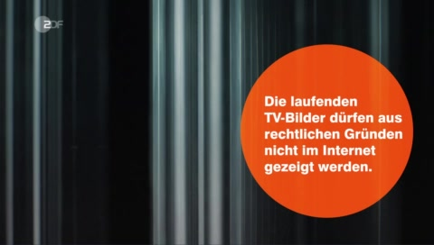

# heuteZensiert

Seit der Einführung des neuen Rundfunkbeitrags am 1.1.2013, ehemals GEZ, zahlen deutsche Haushalte einen geräteunabhängigen Beitrag. TV und Internet wurden hier gleichgestellt. 

> Die Angebote von ARD, ZDF und Deutschlandradio lassen sich heute auf verschiedenen Wegen empfangen – ob über Radio, Fernseher, Computer oder Smartphone.  
> -- [Faktenblatt von www.rundfunkbeitrag.de](https://www.rundfunkbeitrag.de/e175/e224/Faktenblatt_zum_neuen_Rundfunkbeitrag.pdf)  

Viele Personen/Haushalte verzichten mittlerweile aus verschiedene Gründen auf ein Fernsehgerät und nutzen Mediatheken, online Streaming-Dienste usw., die das TV ersetzen. Obwohl sie für das öffentlich-rechtliche Fernsehen gleich viel zahlen, wie für die Nutzung eines Fernsehgerätes, stehen Ihnen online nicht die gleichen Inhalte zur Verfügung. Dieses Projekt beschäftigt sich mit Nachrichtensendungen des ZDF im Speziellen. Online werden Passagen aus der Berichterstattung ausgeschnitten, bzw. mit einem Standbild ("Die laufenden TV- Bilder dürfen aus rechtlichen Gründen nicht im Internet gezeigt werden") überschrieben. Die betroffenen Themenbereiche sind zumeist der Sportteil, aber auch andere Abschnitte können betroffen sein (z.B. eine Ansprache des Papstes oder Bilder zur Berichterstattung zum Erdbeben in Nepal). Welche Inhalte online verfügbar sind und welche nicht, ist für den Endnutzer nicht nachvollziehbar. Ich nehme an, dass es die von Dritten angekaufen Videosequenzen sind. Doch der Knackpunkt ist, wenn das ZDF unsere gemeinsamen Runfunkbeiträge an Dritte ausschüttet, müsste es sich für alle Beitragszahler gleichmäßig einsetzen. Verträge, welche lediglich die TV-Ausstrahulng zulassen, dürfen nicht abgeschlossen werden. TV und Online - wir zahlen das Gleiche, wir wollen das Gleiche sehen. Nur Mut ZDF...  

  

Der etwas reißerische Begriff Zensur wurde mit Absicht gewählt.   
1) Dem digitalen Nachrichtenschauer werden bewusst Inhalte vorenthalten. Da die Nachrichten online zeitgleich (oder gar später) ausgestrahlt werden, hat Letzterer keine Möglichkeit mehr, die zensierten Passagen im TV nachzuschauen.  
2) Die Online-Version der Nachrichtensendung wird offensichtlich nachbearbeitet. Digital Natives sind besonders betroffen und im Vergleich zu analogen Nutzern schlechter informiert.  
3) Da einzelne eMails an `Zuschauerredaktion@zdf.de` leider keine sichtbaren Folgen nach sich ziehen, möchten die Initiatoren eine große Masse zu mobilisieren, um den Druck auf das ZDF zu erhöhen. Gleiche Leistung für gleichen Rundfunkbeitrag!  
4) Ziel ist es datengratragene Krtik am ZDF zu üben, der resuliterende Datensatz ist frei verfügbar. 

  
