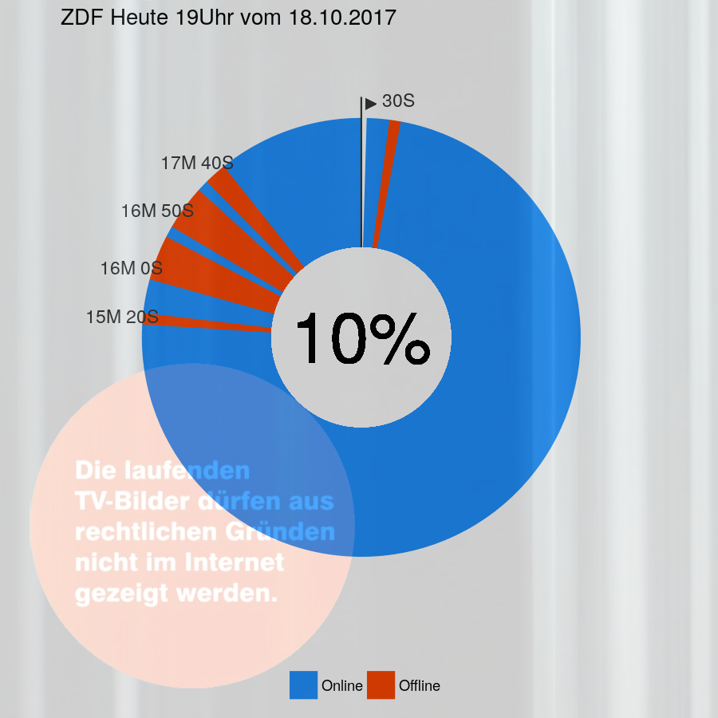

# heuteZensiert

## Hintergrund

Seit der Einführung des neuen Rundfunkbeitrags am 1.1.2013, ehemals GEZ, zahlen deutsche Haushalte einen geräteunabhängigen Beitrag. TV, Radio und Internet wurden hier gleichgestellt. 

> Die Angebote von ARD, ZDF und Deutschlandradio lassen sich heute auf verschiedenen Wegen empfangen – ob über Radio, Fernseher, Computer oder Smartphone.  
> -- [Faktenblatt von www.rundfunkbeitrag.de](https://www.rundfunkbeitrag.de/e175/e224/Faktenblatt_zum_neuen_Rundfunkbeitrag.pdf) vom 29.11.2012

Doch dies trifft nicht auf die gesamten Inhalte zu. Allzuhäufig sind im Online-Angebot der öffentlich-rechtlichen Rundfunkanstalten Banner zu sehen, welche darauf hinweisen, dass bestimmte Inhalte nicht im Internet gezeigt werden können. So lautet die Information auf dem Standbild der Tagesschau

> "Kurze Unterbrechung - Diese Bilder dürfen aus rechtlichen Gründen nicht im Internet gezeigt werden"

Dieses Projekt beschäftigt sich im Speziellen mit den abendlichen Nachrichtensendungen von ARD unf ZDF.

Die von der Zensur betroffenen Themenbereiche sind zumeist der Sportteil, aber auch andere Abschnitte können betroffen sein. Welche Inhalte online verfügbar sind und welche nicht, ist für den Endnutzer nicht nachvollziehbar. Es ist anzunehmen, dass es die von Dritten angekaufen Videosequenzen sind. Doch eigentlich müssten die Sender, wenn sie den neuen Rundfunkbeitrag verwenden, sich bei Verträge mit Dritten für alle Beitragszahler gleichmäßig einsetzen. Ausstrahlungsverträge einzelner Inhalte, welche lediglich die TV-Ausstrahulng zulassen, dürften nicht abgeschlossen werden.

## Ziel von heuteZensiert

Das Ziel des Projektes ist eine strukturierte, standardisierte und transparente Auswertung von Bürgerfinanzierten Medieninhalten. So soll eine datengetragene Krtik an öffentlich-rechtlichen Rundfunkanstalten geübt und eine Disskussionsgrundlage geschaffen werden um die Medienlanschaft in Deutschland zu reformieren. 

**TV und Online - wir zahlen das Gleiche, wir wollen das Gleiche sehen.**

# heuteStatistik
Um den genauen Anteil der nicht ausgestrahlen Nachrichtensendungen zu erfassen, werden *ZDF heute 19 Uhr*, *ZDF heute Journal* und * ARD Tagesschau* automatisch online gestreamt. Ein kleines *R* Programm erkennt mithilfe von [Texterkennungssoftware](https://github.com/ropensci/tesseract) die zensierten Frames. Anschließend veröffentlicht dieser [Twitter-Bot](https://twitter.com/heuteNichtDrin) das Ergebnis.

  

Der etwas reißerische Begriff Zensur wurde mit Absicht gewählt.   
1) Dem digitalen Nachrichtenschauer werden bewusst Inhalte vorenthalten. Da die Nachrichten online zeitgleich (oder gar später) ausgestrahlt werden, hat Letzterer keine Möglichkeit mehr, die zensierten Passagen im TV nachzuschauen.  
2) Die Online-Version der Nachrichtensendung wird offensichtlich nachbearbeitet. Digital Natives sind besonders betroffen und im Vergleich zu analogen Nutzern schlechter informiert. In Zeiten steigender Popularität von Internetstreaming-Angeboten ist es an der Zeit die Nutzungsgewohnheiten einer anzuerkennen und die Rechtepolitik anzupassen!
3) Da einzelne eMails an `Zuschauerredaktion@zdf.de` leider keine sichtbaren Folgen nach sich ziehen, möchten die Initiatoren eine große Masse mobilisieren, um den Druck auf die öffentlich-rechtlichen Rundfunkanstalten erhöhen. Gleiche Leistung für gleichen Rundfunkbeitrag!  

# heuteMitmachen
Das Open-Source Projekt läd zum mitmachen ein. Neben den Tweets wird auch ein [Tabelle](Logfile.csv) fortgeschrieben. Wir laden Interessierte und Wissenschaftler aller Disziplinen ein, diese Datengrundlage für sekundäre Analysen heranzuziehen. Die Installation des Projektes ist  [hier](./Install.md) beschrieben. 

# heuteWeiterentwickeln
Es zeigen sich weitere Potentiale der Analyse einiger der wichtigsten Nachrichtenquellen in Deutschland. Diese liese sich auszuweiten, um beispielsweise auch  Rede- bzw. Präsenzzeiten von Personen des öffentlichen und politischen Lebens zu analysieren. 

